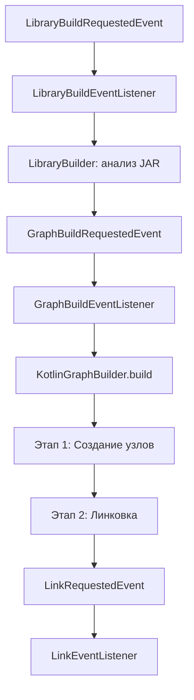

# Алгоритм построения графа кода в Doc-Generator

## Обзор

Система Doc-Generator строит граф кода в **три основных этапа**:

1. **Этап 0: Построение графа библиотек** (Library Graph Building)
2. **Этап 1: Создание узлов приложения** (Node Creation)
3. **Этап 2: Линковка связей** (Edge Linking)

Процесс запускается через систему событий Spring и выполняется асинхронно.

---

## Общая схема процесса



---

## Этап 0: Построение графа библиотек

**Цель:** Проанализировать внешние зависимости (JAR-файлы) и создать индекс библиотечных узлов для последующей линковки интеграционных точек.

### Подэтапы:

#### 0.1. Инициализация
- Получение события `LibraryBuildRequestedEvent` с параметрами:
  - `applicationId` - ID приложения
  - `classpath` - список JAR-файлов
  - `sourceRoot` - корень исходников

#### 0.2. Парсинг JAR-файлов
- Для каждого JAR-файла из classpath:
  - Открытие архива
  - Поиск `.class` файлов
  - Извлечение байткода

#### 0.3. Анализ байткода
- **Анализ классов:**
  - Извлечение FQN (Fully Qualified Name)
  - Определение модификаторов (public, abstract, etc.)
  - Извлечение суперклассов и интерфейсов
  - Сбор аннотаций класса

- **Анализ методов:**
  - Извлечение сигнатур методов
  - Определение параметров и возвращаемых типов
  - Сбор аннотаций методов
  - **Построение Call Graph** (граф вызовов внутри метода)

#### 0.4. Детекция интеграционных точек
- **HTTP endpoints** (Spring Web):
  - Поиск аннотаций: `@GetMapping`, `@PostMapping`, `@RequestMapping`, etc.
  - Извлечение URL, HTTP-метода
  - Детекция retry/timeout/circuit breaker паттернов

- **Kafka topics**:
  - Поиск вызовов `KafkaTemplate.send()`, `@KafkaListener`
  - Извлечение названий топиков
  - Определение операции (PRODUCE/CONSUME)

- **Camel routes**:
  - Поиск вызовов Camel API
  - Извлечение URI эндпоинтов
  - Определение типа протокола

#### 0.5. Создание LibraryNode
- Сохранение в таблицу `library_node`:
  - `class_fqn` - полное имя класса
  - `method_fqn` - полное имя метода
  - `signature` - сигнатура метода
  - `annotations` - JSON с аннотациями
  - `call_graph` - JSON с графом вызовов
  - `integration_points` - JSON с интеграционными точками

#### 0.6. Построение индекса
- Создание `LibraryNodeIndex`:
  - Индекс по `method_fqn` для быстрого поиска
  - Индекс по `class_fqn`
  - Индекс по интеграционным точкам

#### 0.7. Публикация события
- Публикация `GraphBuildRequestedEvent` для запуска построения графа приложения

---

## Этап 1: Создание узлов приложения

**Цель:** Проанализировать исходный код приложения и создать узлы графа (Node) для всех сущностей кода.

### Подэтапы:

#### 1.1. Инициализация транзакции
- Создание `TransactionTemplate`
- Подсчет текущего количества узлов и рёбер в БД

#### 1.2. Создание CommandExecutor
- Инициализация `CommandExecutorImpl` с зависимостями:
  - `NodeRepository` - для сохранения узлов
  - `NodeKindRefiner` - для уточнения типа узла
  - `NodeValidator` - для валидации узлов
  - `CodeNormalizer` - для нормализации кода
  - `CodeHasher` - для вычисления хешей
  - `NodeUpdateStrategy` - стратегия обновления
  - `ApiMetadataCollector` - сбор метаданных API

#### 1.3. Парсинг исходного кода
- **Обход файловой системы:**
  - Рекурсивный обход `sourceRoot`
  - Фильтрация файлов по расширению `.kt`
  - Чтение содержимого файлов

- **Парсинг Kotlin AST:**
  - Использование Kotlin Compiler API
  - Построение Abstract Syntax Tree (AST)
  - Обход AST через `KotlinToDomainVisitor`

#### 1.4. Извлечение деклараций
- **Для каждого файла:**
  - Извлечение package declaration
  - Извлечение imports
  - Поиск top-level деклараций

- **Типы деклараций:**
  - **Package** - пакеты
  - **Class** - классы
  - **Interface** - интерфейсы
  - **Enum** - перечисления
  - **Object** - объекты
  - **Function** - функции
  - **Property** - свойства

#### 1.5. Создание команд построения
- Для каждой декларации создается команда через `DeclPlanner`:
  - `CreatePackageCommand`
  - `CreateClassCommand`
  - `CreateMethodCommand`
  - `CreateFieldCommand`
  - etc.

#### 1.6. Обработка команд
- **Для каждой команды:**
  
  **1.6.1. Извлечение метаданных**
  - FQN (Fully Qualified Name)
  - Simple name
  - Package name
  - Owner FQN (для вложенных сущностей)
  - Модификаторы (public, private, etc.)
  - Аннотации
  - Суперклассы и интерфейсы
  - Параметры и возвращаемый тип (для методов)
  - Imports файла
  
  **1.6.2. Извлечение usage информации**
  - **RawUsage.Simple** - простые вызовы (`foo()`)
  - **RawUsage.Dot** - вызовы через точку (`obj.method()`)
  - Флаг `isCall` - является ли вызовом метода
  
  **1.6.3. Уточнение типа узла (NodeKindRefiner)**
  - Анализ аннотаций для определения специфичного типа:
    - `@Service` → `NodeKind.SERVICE`
    - `@RestController` → `NodeKind.ENDPOINT`
    - `@Mapper` → `NodeKind.MAPPER`
    - `@Configuration` → `NodeKind.CONFIG`
    - `@GetMapping`, `@PostMapping` → `NodeKind.ENDPOINT`
    - `@Scheduled` → `NodeKind.JOB`
    - `@KafkaListener` → `NodeKind.TOPIC`
  
  **1.6.4. Сбор API метаданных (ApiMetadataCollector)**
  - Для REST endpoints:
    - HTTP метод
    - URL path
    - Request/Response типы
  - Для Kafka listeners:
    - Topic name
    - Consumer group
  - Для Scheduled jobs:
    - Cron expression
    - Fixed delay/rate
  
  **1.6.5. Нормализация кода (CodeNormalizer)**
  - Удаление комментариев
  - Нормализация whitespace
  - Удаление пустых строк
  - Приведение к каноническому виду
  
  **1.6.6. Вычисление хеша (CodeHasher)**
  - SHA-256 хеш нормализованного кода
  - Используется для определения изменений
  
  **1.6.7. Валидация (NodeValidator)**
  - Проверка корректности FQN
  - Проверка наличия обязательных полей
  - Валидация метаданных
  
  **1.6.8. Стратегия обновления (NodeUpdateStrategy)**
  - Поиск существующего узла по FQN
  - Сравнение хешей:
    - **Хеши совпадают** → пропуск (skipped)
    - **Хеши различаются** → обновление (updated)
    - **Узел не найден** → создание (created)
  
  **1.6.9. Сохранение узла**
  - Создание объекта `Node`:
    - `id` - UUID
    - `fqn` - полное имя
    - `name` - простое имя
    - `kind` - тип узла
    - `packageName` - имя пакета
    - `sourceCode` - исходный код
    - `codeHash` - хеш кода
    - `meta` - JSON с метаданными
    - `applicationId` - ID приложения
  - Сохранение в БД через `NodeRepository`

#### 1.7. Сбор статистики
- Подсчет созданных узлов (created)
- Подсчет обновленных узлов (updated)
- Подсчет пропущенных узлов (skipped)
- Общее количество обработанных узлов (total)

#### 1.8. Логирование результатов
- Вывод статистики построения узлов
- Вывод времени выполнения

---

## Этап 2: Линковка связей

**Цель:** Создать рёбра (Edge) между узлами графа, отражающие различные типы связей в коде.

### Подэтапы:

#### 2.1. Загрузка всех узлов
- Запрос всех узлов приложения из БД
- Проверка на пустой результат
- Логирование количества узлов для линковки

#### 2.2. Создание индекса узлов
- Создание `MutableNodeIndex`:
  - **byFqn** - Map<String, Node> для поиска по FQN
  - **bySimple** - Map<String, List<Node>> для поиска по простому имени
  - **packages** - Map<String, Node> для пакетов
- Поддержка динамического добавления узлов

#### 2.3. Структурная линковка (StructuralEdgeLinker)
- **Цель:** Создать связи CONTAINS между контейнерами и их содержимым

**2.3.1. Связи пакет → тип**
- Для каждого узла типа (CLASS, INTERFACE, ENUM, SERVICE, etc.):
  - Извлечение `packageName`
  - Поиск узла пакета в индексе
  - Создание ребра: `(package) --CONTAINS--> (type)`

**2.3.2. Связи тип → член**
- Для каждого узла-члена (METHOD, FIELD, ENDPOINT, JOB, TOPIC):
  - Извлечение `ownerFqn` из метаданных
  - Поиск узла-владельца в индексе
  - Создание ребра: `(owner) --CONTAINS--> (member)`

#### 2.4. Итеративная линковка узлов
- **Для каждого узла в цикле:**

**2.4.1. Логирование прогресса**
- Вывод процента выполнения
- Вывод текущего узла (kind + fqn)

**2.4.2. Извлечение метаданных**
- Десериализация JSON метаданных в `NodeMeta`

**2.4.3. Линковка наследования (InheritanceEdgeLinker)**
- **Применяется только к узлам типов** (CLASS, INTERFACE, ENUM, etc.)
- Для каждого супертипа:
  - Резолв типа через `resolveType()`
  - Определение типа связи:
    - **Супертип = INTERFACE** → создание рёбер:
      - `(node) --IMPLEMENTS--> (interface)`
      - `(node) --DEPENDS_ON--> (interface)`
    - **Супертип = CLASS** → создание рёбер:
      - `(node) --INHERITS--> (superclass)`
      - `(node) --DEPENDS_ON--> (superclass)`

**2.4.4. Линковка аннотаций (AnnotationEdgeLinker)**
- **Применяется ко всем узлам**
- Для каждой аннотации:
  - Резолв типа аннотации через `resolveType()`
  - Создание рёбер:
    - `(node) --ANNOTATED_WITH--> (annotation)`
    - `(node) --DEPENDS_ON--> (annotation)`

**2.4.5. Линковка зависимостей сигнатуры (SignatureDependencyLinker)**
- **Применяется только к функциональным узлам** (METHOD, ENDPOINT, JOB, TOPIC)
- Для каждого типа в сигнатуре:
  - **Параметры метода:**
    - Резолв типа параметра
    - Создание ребра: `(method) --DEPENDS_ON--> (paramType)`
  - **Возвращаемый тип:**
    - Резолв возвращаемого типа
    - Создание ребра: `(method) --DEPENDS_ON--> (returnType)`

**2.4.6. Линковка вызовов (CallEdgeLinker)**
- **Применяется только к функциональным узлам**
- Для каждого usage в `rawUsages`:
  
  **Обработка RawUsage.Simple:**
  - Попытка 1: Поиск в owner классе
    - Построение FQN: `{ownerFqn}.{usageName}`
    - Поиск в индексе
    - Если найдено → создание ребра: `(node) --CALLS--> (target)`
  - Попытка 2: Резолв через imports
    - Если `isCall == true`
    - Резолв типа через `resolveType()`
    - Создание ребра: `(node) --CALLS--> (target)`
  
  **Обработка RawUsage.Dot:**
  - Определение типа receiver:
    - Если receiver начинается с заглавной буквы → статический вызов
      - Резолв типа receiver через `resolveType()`
    - Иначе → вызов на instance
      - Использование owner класса
  - Построение FQN члена: `{receiverType.fqn}.{member}`
  - Поиск в индексе
  - Создание ребра: `(node) --CALLS--> (target)`

**2.4.7. Линковка интеграций (IntegrationEdgeLinker)**
- **Применяется только к функциональным узлам**
- Для каждого usage:
  
  **Шаг 1: Поиск метода в библиотеках**
  - Построение FQN метода библиотеки
  - Поиск в `LibraryNodeIndex`
  
  **Шаг 2: Создание прямой связи с LibraryNode**
  - Создание `LibraryNodeEdgeProposal`:
    - `kind = CALLS_CODE`
    - `node = текущий узел`
    - `libraryNode = найденный LibraryNode`
  
  **Шаг 3: Извлечение интеграционных точек**
  - Вызов `IntegrationPointService.extractIntegrationPoints(libraryNode)`
  
  **Шаг 4: Обработка HTTP endpoints**
  - Создание связи с LibraryNode:
    - `kind = CALLS_HTTP`
  - Создание виртуального узла ENDPOINT:
    - Вызов `VirtualNodeFactory.getOrCreateEndpointNode()`
    - Параметры: URL, HTTP method
    - Если узел новый → добавление в список новых узлов
  - Создание ребра: `(node) --CALLS_HTTP--> (endpointNode)`
  - Обработка дополнительных паттернов:
    - **Retry:** `(node) --RETRIES_TO--> (endpointNode)`
    - **Timeout:** `(node) --TIMEOUTS_TO--> (endpointNode)`
    - **Circuit Breaker:** `(node) --CIRCUIT_BREAKER_TO--> (endpointNode)`
  
  **Шаг 5: Обработка Kafka topics**
  - Создание связи с LibraryNode:
    - `kind = PRODUCES` или `CONSUMES`
  - Создание виртуального узла TOPIC:
    - Вызов `VirtualNodeFactory.getOrCreateTopicNode()`
    - Параметр: topic name
    - Если узел новый → добавление в список новых узлов
  - Создание ребра:
    - **PRODUCE:** `(node) --PRODUCES--> (topicNode)`
    - **CONSUME:** `(node) --CONSUMES--> (topicNode)`
  
  **Шаг 6: Обработка Camel routes**
  - Создание связи с LibraryNode (если HTTP):
    - `kind = CALLS_HTTP`
  - Создание виртуального узла ENDPOINT:
    - Параметры: URI, endpoint type
    - Если узел новый → добавление в список новых узлов
  - Создание ребра (если HTTP):
    - `(node) --CALLS_HTTP--> (endpointNode)`

**2.4.8. Линковка исключений (ThrowEdgeLinker)**
- **Применяется только к функциональным узлам**
- Для каждого типа исключения в метаданных:
  - Резолв типа исключения
  - Создание ребра: `(node) --THROWS--> (exceptionType)`

**2.4.9. Обработка ошибок**
- Try-catch вокруг линковки вызовов
- Подсчет ошибок (`callsErrors`)
- Логирование ошибок с FQN узла

#### 2.5. Обновление индекса новыми узлами
- Проверка наличия новых узлов (ENDPOINT, TOPIC)
- Добавление новых узлов в `MutableNodeIndex`
- Логирование количества новых узлов

#### 2.6. Сохранение рёбер в БД
- **Сохранение обычных рёбер (Node → Node):**
  - Преобразование в `SimpleEdgeProposal`
  - Batch upsert через `GraphSink.upsertEdges()`
  - Структура Edge:
    - `id` - UUID
    - `kind` - тип ребра
    - `srcNodeId` - ID исходного узла
    - `dstNodeId` - ID целевого узла
    - `applicationId` - ID приложения

- **Сохранение рёбер к LibraryNode (Node → LibraryNode):**
  - Batch upsert через `LibraryNodeGraphSink.upsertLibraryNodeEdges()`
  - Структура LibraryNodeEdge:
    - `id` - UUID
    - `kind` - тип ребра
    - `nodeId` - ID узла приложения
    - `libraryNodeId` - ID узла библиотеки
    - `applicationId` - ID приложения

#### 2.7. Логирование результатов
- Количество ошибок при линковке вызовов
- Количество новых интеграционных узлов
- Количество прямых связей с библиотечными узлами
- Общее время выполнения

#### 2.8. Публикация события завершения
- Публикация `LinkRequestedEvent` (опционально)
- Обновление статуса приложения

---

## Типы рёбер (EdgeKind)

| Тип ребра | Описание | Источник | Назначение |
|-----------|----------|----------|------------|
| `CONTAINS` | Структурная вложенность | Package/Type | Type/Member |
| `INHERITS` | Наследование класса | Class | Superclass |
| `IMPLEMENTS` | Реализация интерфейса | Class | Interface |
| `ANNOTATED_WITH` | Аннотация | Any | Annotation |
| `DEPENDS_ON` | Зависимость типа | Any | Type |
| `CALLS` | Вызов метода | Method | Method |
| `CALLS_CODE` | Вызов библиотечного кода | Method | LibraryNode |
| `CALLS_HTTP` | HTTP вызов | Method | Endpoint/LibraryNode |
| `PRODUCES` | Публикация в Kafka | Method | Topic/LibraryNode |
| `CONSUMES` | Подписка на Kafka | Method | Topic/LibraryNode |
| `THROWS` | Выброс исключения | Method | Exception |
| `RETRIES_TO` | Retry паттерн | Method | Endpoint/LibraryNode |
| `TIMEOUTS_TO` | Timeout паттерн | Method | Endpoint/LibraryNode |
| `CIRCUIT_BREAKER_TO` | Circuit Breaker паттерн | Method | Endpoint/LibraryNode |

---

## Типы узлов (NodeKind)

| Тип узла | Описание | Создается на этапе |
|----------|----------|-------------------|
| `PACKAGE` | Пакет | Этап 1 |
| `CLASS` | Класс | Этап 1 |
| `INTERFACE` | Интерфейс | Этап 1 |
| `ENUM` | Перечисление | Этап 1 |
| `RECORD` | Record класс | Этап 1 |
| `SERVICE` | Spring Service | Этап 1 |
| `MAPPER` | MyBatis Mapper | Этап 1 |
| `CONFIG` | Configuration класс | Этап 1 |
| `METHOD` | Метод | Этап 1 |
| `FIELD` | Поле | Этап 1 |
| `ENDPOINT` | REST endpoint / HTTP endpoint | Этап 1 / Этап 2 |
| `JOB` | Scheduled job | Этап 1 |
| `TOPIC` | Kafka topic | Этап 2 |

---

## Структуры данных

### Node (Узел графа)
```kotlin
data class Node(
    val id: UUID,
    val fqn: String,              // Полное квалифицированное имя
    val name: String,             // Простое имя
    val kind: NodeKind,           // Тип узла
    val packageName: String?,     // Имя пакета
    val sourceCode: String?,      // Исходный код
    val codeHash: String?,        // SHA-256 хеш кода
    val meta: Map<String, Any>,   // JSON метаданные
    val applicationId: UUID       // ID приложения
)
```

### NodeMeta (Метаданные узла)
```kotlin
data class NodeMeta(
    val ownerFqn: String?,                    // FQN владельца
    val imports: List<String>?,               // Список импортов
    val annotations: List<String>?,           // Список аннотаций
    val supertypesResolved: List<String>?,    // Разрешенные супертипы
    val supertypesSimple: List<String>?,      // Простые имена супертипов
    val rawUsages: List<RawUsage>?,           // Использования в коде
    val parameters: List<Parameter>?,         // Параметры метода
    val returnType: String?,                  // Возвращаемый тип
    val apiMetadata: ApiMetadata?             // API метаданные
)
```

### RawUsage (Использование в коде)
```kotlin
sealed class RawUsage {
    data class Simple(
        val name: String,      // Имя вызываемой сущности
        val isCall: Boolean    // Является ли вызовом метода
    ) : RawUsage()
    
    data class Dot(
        val receiver: String,  // Receiver вызова
        val member: String     // Член receiver'а
    ) : RawUsage()
}
```

### Edge (Ребро графа)
```kotlin
data class Edge(
    val id: UUID,
    val kind: EdgeKind,        // Тип ребра
    val srcNodeId: UUID,       // ID исходного узла
    val dstNodeId: UUID,       // ID целевого узла
    val applicationId: UUID    // ID приложения
)
```

### LibraryNode (Узел библиотеки)
```kotlin
data class LibraryNode(
    val id: UUID,
    val classFqn: String,                      // FQN класса
    val methodFqn: String?,                    // FQN метода
    val signature: String?,                    // Сигнатура метода
    val annotations: Map<String, Any>?,        // Аннотации
    val callGraph: CallGraph?,                 // Граф вызовов
    val integrationPoints: List<IntegrationPoint>?  // Интеграционные точки
)
```

### IntegrationPoint (Интеграционная точка)
```kotlin
sealed class IntegrationPoint {
    data class HttpEndpoint(
        val url: String?,
        val httpMethod: String?,
        val hasRetry: Boolean,
        val hasTimeout: Boolean,
        val hasCircuitBreaker: Boolean
    ) : IntegrationPoint()
    
    data class KafkaTopic(
        val topic: String?,
        val operation: String  // PRODUCE или CONSUME
    ) : IntegrationPoint()
    
    data class CamelRoute(
        val uri: String?,
        val endpointType: String?
    ) : IntegrationPoint()
}
```

---

## Алгоритмы резолва типов

### resolveType(simpleOrFqn, imports, pkg)

**Цель:** Найти узел типа по простому или полному имени

**Алгоритм:**
1. Попытка 1: Прямой поиск по FQN
   - `index.findByFqn(simpleOrFqn)`
   - Если найдено → возврат

2. Попытка 2: Извлечение простого имени
   - Извлечь последнюю часть после точки
   - Удалить `?` (nullable)
   - Удалить generics (`<...>`)

3. Попытка 3: Поиск через imports
   - Для каждого import:
     - Если import заканчивается на `.{simpleName}`
     - Поиск по FQN из import
     - Если найдено → возврат

4. Попытка 4: Поиск в текущем пакете
   - Построение FQN: `{pkg}.{simpleName}`
   - Поиск по FQN
   - Если найдено → возврат

5. Попытка 5: Поиск по простому имени
   - Поиск в `bySimple` индексе
   - Возврат первого найденного

---

## Оптимизации производительности

### Текущие оптимизации:
1. **Batch операции** - все рёбра сохраняются одним запросом
2. **Индексирование** - быстрый поиск узлов по FQN и простому имени
3. **Мутабельный индекс** - поддержка динамического добавления узлов
4. **Транзакции** - использование Spring транзакций для консистентности
5. **Асинхронность** - построение графа выполняется в фоне

### Потенциальные оптимизации:
1. **Кеширование resolveType** - кеш результатов резолва типов
2. **Параллелизация линковки** - параллельная обработка узлов
3. **Уменьшение логирования** - логирование только каждые N%
4. **Streaming обработка** - обработка узлов потоком вместо загрузки всех в память

---

## Метрики и мониторинг

### Собираемые метрики:
- Количество созданных узлов (created)
- Количество обновленных узлов (updated)
- Количество пропущенных узлов (skipped)
- Количество созданных рёбер
- Количество ошибок линковки
- Время выполнения каждого этапа
- Использование памяти

### Логируемые события:
- Начало/завершение каждого этапа
- Прогресс линковки (процент выполнения)
- Ошибки парсинга и линковки
- Статистика построения графа

---

## Обработка ошибок

### Стратегии обработки:
1. **Ошибки парсинга** - логирование + пропуск файла
2. **Ошибки линковки вызовов** - логирование + подсчет ошибок + продолжение
3. **Ошибки валидации** - отклонение узла + логирование
4. **Ошибки БД** - откат транзакции + обновление статуса приложения

### Статусы приложения:
- `running` - построение графа в процессе
- `success` - граф успешно построен
- `failed` - построение графа завершилось с ошибкой

---

## Примеры использования

### Запуск построения графа:
```kotlin
eventPublisher.publishEvent(
    LibraryBuildRequestedEvent(
        applicationId = app.id!!,
        classpath = listOf(File("/path/to/lib.jar")),
        sourceRoot = Paths.get("/path/to/src")
    )
)
```

### Поиск узла по FQN:
```kotlin
val node = nodeIndex.findByFqn("com.example.MyClass")
```

### Резолв типа:
```kotlin
val type = nodeIndex.resolveType(
    simpleOrFqn = "MyClass",
    imports = listOf("com.example.MyClass"),
    pkg = "com.example"
)
```
